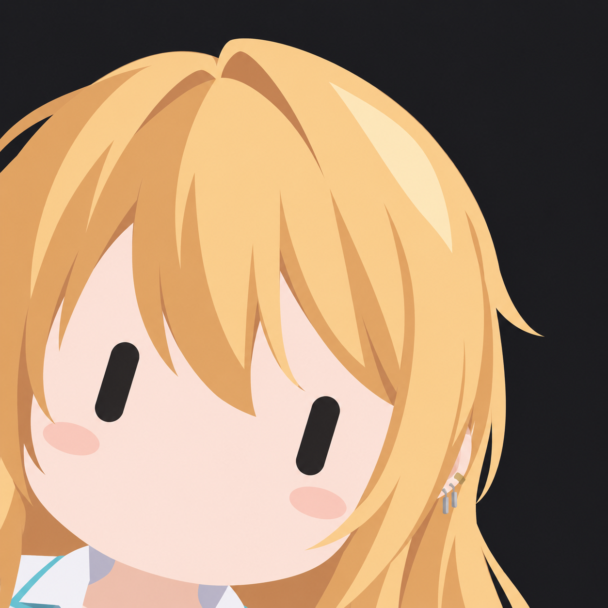

<div align="center">
  

  <h1>Chibot Studio - Your character, as a little bot.</h1>
</div>

Chibot Studio is a small creative web project focused on transforming characters and people from reference images into minimalist 2D bot-style icons.

The project provides carefully structured prompts designed to preserve the most recognizable visual characteristics of the original subject while applying a consistent bot aesthetic: a rounded face, minimalist features, dark capsule-shaped eyes, simplified hair, and a dark background.

**Live website:** [chibotstudio.vercel.app](https://chibotstudio.vercel.app/)

**Repository:** [Yagasaki7K/website-chibot](https://github.com/Yagasaki7K/website-chibot)

## Features

* Minimalist 2D bot-style character transformation
* Short and full prompt versions
* One-click prompt copying
* Multilingual interface
* English
* Portuguese
* Korean
* Japanese
* Interactive character result gallery
* Short-prompt result examples
* Full-prompt result examples
* Latest updates section
* Toast notifications for clipboard actions
* SEO metadata and Open Graph configuration
* Responsive interface
* Styled Components integration with Next.js

## The Chibot Style

The prompts are designed around a specific visual language rather than simply asking an image model to "make a character into a bot."

The transformation prioritizes:

* Two black capsule-shaped eyes
* A rounded bot face
* No mouth or nose
* Simplified hair silhouettes
* Preservation of the original character's key colors
* Minimal accessories
* Flat and soft color areas
* Minimal shading
* A dark charcoal background
* An extreme close-up composition
* A slightly tilted head
* A 1:1 square canvas

The prompts also contain conflict-resolution rules so that the most important visual characteristics remain consistent when different instructions compete with each other.

## Internationalization

The interface supports four languages:

| Language  | Code   |
| --------- | ------ |
| English   | `en`   |
| Português | `ptbr` |
| 한국어    | `ko`   |
| 日本語    | `ja`   |

The selected language controls both the interface text and the language of the copied prompts.

The translations are maintained in:

```text
src/i18n/language.ts
```

## Interactive Gallery

The website includes several sets of generated examples.

Users can select different characters and visual variations to preview the results directly in the interface.

The gallery is divided into examples generated with:

* The short prompt
* The full prompt
* Additional recent examples

The selected image is displayed as the main preview while the smaller images act as interactive selectors.

## Copy to Clipboard

Both prompt buttons use the browser Clipboard API.

When a prompt is successfully copied, Chibot Studio displays a localized success notification.

If the browser cannot access the clipboard, a localized error notification is displayed instead.

The project uses [Sonner](https://sonner.emilkowal.ski/) for these notifications.

## 🛠️ Tech Stack

| Technology        | Purpose                                 |
| ----------------- | --------------------------------------- |
| Next.js           | React framework and application runtime |
| React             | User interface                          |
| TypeScript        | Static typing                           |
| styled-components | Component styling                       |
| Sonner            | Toast notifications                     |
| next-seo          | SEO and social metadata                 |
| Supabase          | Backend/database tooling                |
| Vercel            | Deployment                              |

## Project Structure

The project follows the Next.js Pages Router structure:

```text
.
├── public/
│   ├── *.png
│   └── ...
│
├── src/
│   ├── components/
│   │   └── ...
│   │
│   ├── i18n/
│   │   └── language.ts
│   │
│   ├── pages/
│   │   ├── _app.tsx
│   │   ├── _document.tsx
│   │   └── index.tsx
│   │
│   └── ...
│
├── next.config.ts
├── package.json
├── tsconfig.json
└── README.md
```

The main interface logic lives in:

```text
src/pages/index.tsx
```

The localization data is maintained in:

```text
src/i18n/language.ts
```

Static character images and visual assets are stored in:

```text
public/
```

## Getting Started

### Prerequisites

Make sure you have:

* Node.js
* Bun
* Git

### Clone the repository

```bash
git clone https://github.com/Yagasaki7K/website-chibot.git

cd website-chibot
```

### Install dependencies

Using Bun:

```bash
bun install
```

Or using npm:

```bash
npm install
```

### Run the development server

Using Bun:

```bash
bun dev
```

Using npm:

```bash
npm run dev
```

The application will be available at:

```text
http://localhost:3000
```

## Contributing

Contributions, improvements, translations, visual experiments, and bug reports are welcome.

If you want to contribute:

1. Fork the repository.
2. Create a new branch.
3. Make your changes.
4. Run the production build to verify the project.
5. Commit your changes.
6. Open a pull request.

For translation improvements, update:

```text
src/i18n/language.ts
```

When adding a new language, make sure all interface strings and both prompt versions are translated consistently.

## Issues

If you find a bug or have an idea for improving Chibot Studio, open an issue in the repository.

Please include:

* A clear description
* Steps to reproduce the problem, when applicable
* Browser and operating system information for browser-specific issues
* Screenshots or examples when they help explain the problem

## License

This repository does not currently define a license file.

If the project is intended to be open source for reuse, a license should be added to the repository before granting explicit reuse permissions.

## Author

Built by **Anderson "Yagasaki" Marlon**.

GitHub:

[Yagasaki7K](https://github.com/Yagasaki7K?utm_source=chatgpt.com)
